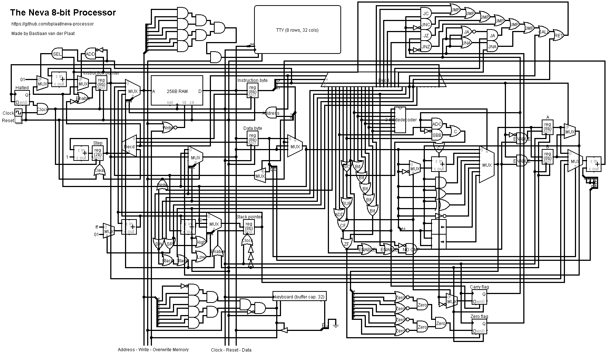

# The Neva 8-bit Processor
The Neva 8-bit Processor is a simple, educational 8-bit processor design with dedicated assembler. I've made this processor for school and this repo contains all the work off that project. That includes the processor design, assembler and a complete online simulation environment so you can create programs quickly and run them immediately.

## The Processor Design
The file `design.circ` is a [Logism](http://www.cburch.com/logisim/) circuit which contains the complete processor:



## Inspiration
There where is some sites and articles that inspired my to build this project:
- https://en.wikipedia.org/wiki/MOS_Technology_6502
- https://en.wikichip.org/wiki/intel/mcs-8/isa
- https://en.wikipedia.org/wiki/X86_instruction_listings
- https://schweigi.github.io/assembler-simulator/

## Instruction encoding
The instruction encoding is very simple because each instruction is two bytes long and these two bytes are then subdivided into different sections which mean different things.

There are two different instruction encodings for the processor the first is the immediate data encoding and the second is the register encoding:

### Data encoding:
The first two bits of the first byte are the mode selector (more information about that below), the second bit is the destination register selector and the last five bits are the instruction opcode, the other byte contains an immediate data.
```
  5     1   2   |  8
opcode reg mode | imm
```

### Register encoding:
The other encoding is almost the same the only difference is that the immediate data byte is changed to one source register selector and a 6-bit displacement.
```
  5     1   2   |  2   6
opcode reg mode | reg dis
```

## Registers
The processor has two 8-bit registers: A and B, there is also a instruction and stack pointer but those are only readable. You use 0 for the A register, 1 for the B register, 2 for the instruction pointer and 3 for the stack pointer. There are also two flag d flip-flops those are set by some instructions and are used for the conditional jump and branch instructions.
```
0 = A = 0
1 = B = 0

-- Not writable and storable
2 = ip = instruction pointer = 0
3 = sp = stack pointer = 0xfd or 0xfa

carry flag = 0
zero flag = 0
```

## Modes
Like I sad each instruction has two bits that select a mode which the instruction is run in. This mode chooses what the source data is for the instruction. There are four different modes:
- The first is that the next immediate byte is used as the data.
- The second is that the first two bits of the next byte is used to select a register which contains the data and then adds the displacement.
- The third mode is that de next immediate byte is used as a address for the memory and the read byte is used as data.
- The fourth mode reads a register adds the displacement and uses it as the address for the memory and uses the byte that it reads as data.
```
0 = data = imm
1 = data = reg + dis
2 = address = imm, data = [address]
3 = address = reg + dis, data = [address]
```

## Instructions
Because we use five bits for the instruction opcode there is room for 32 different instructions:
```
0 = nop

1 = load = reg = data
2 = store (mode = 2 or mode = 3) = mem[address] = reg

-- effects carray flag and zero flag
3 = add = reg += data
4 = adc = reg += data + carry
5 = sub = reg -= data
6 = sbb = reg -= data + carry
7 = cmp = reg - data (set only flags)

-- effects zero flag
8 = and = reg &= data
9 = or = reg |= data
10 = xor = reg ^= data
11 = not = reg = ~data
12 = shl = reg <<= data & 7
13 = shr = reg >>= data & 7

14 = jmp (reg = 0) = ip = data
15 = jc (reg = 0) = if (carry) ip = data
16 = jnc (reg = 0) = if (!carry) ip = data
17 = jz (reg = 0) = if (zero) ip = data
18 = jnz (reg = 0) = if (!zero) ip = data
19 = ja (reg = 0) = if (!carry && !zero) ip = data
20 = jna (reg = 0) = if (carry || zero) ip = data

14 = bra (reg = 1) = ip += data
15 = bc (reg = 1) = if (carry) ip += data
16 = bnc (reg = 1) = if (!carry) ip += data
17 = bz (reg = 1) = if (zero) ip += data
18 = bnz (reg = 1) = if (!zero) ip += data
19 = ba (reg = 1) = if (!carry && !zero) ip += data
20 = bna (reg = 1) = if (carry || zero) ip += data

21 = push (mode = 0 or mode = 1) = mem[sp--] = data
22 = pop (mode = 2 or mode = 3) = reg = mem[++sp]
23 = call (reg = 0, mode = 0 or mode = 1) = mem[sp--] = ip, ip = data
23 = bcall (reg = 1, mode = 0 or mode = 1) = mem[sp--] = ip, ip += data
24 = ret (reg = 0, mode = 2 or mode = 3) = ip = mem[sp + 1], sp += address + 1
24 = bret (reg = 1, mode = 2 or mode = 3) = ip += mem[sp + 1], sp += address + 1

25 / 30 = nothing

31 = halt
```

There are also some pseudo instructions which the assembler translates to other instructions:
```
mov reg, data = load reg, data
mov [data], reg = store reg, [data]

inc reg = add reg, 1
dec reg = sub reg, 1

jb data = jc data
jnae data = jc data
jnb data = jnc data
jae data = jnc data

je data = jz data
jne data = jnz data

jnbe data = ja data
jbe data = jna data

bb data = bc data
bnae data = bc data
bnb data = bnc data
bae data = bnc data

be data = bz data
bne data = bnz data

bnbe data = ba data
bbe data = bna data
```

## Memory I/O interface
All input and output options of the computer are based on memory addresses. So you need to read or write to some specific addresses to communicate with other devices:
```
0xfe = Read a ASCII character from the keyboard
0xff = Write an ASCII character to the terminal display

-- Only in the JavaScript simulator
0xfb = x position
0xfc = y position
0xfd = 0 = clear the points
       1 = render points to the screen
       2 = move the pen to this position
       3 = line the pen to this position
       4 = move the pen to this position relative to the last point
       5 = line the pen to this position relative to the last point

```

## Online simulator and assembler
There is an online processor simulator and assembler available at [neva-processor.ml](https://neva-processor.ml/)


## Assembler for Logism
The file `asm.js` contains a simple assembler written in JavaScript, you need [Node.js](https://nodejs.org/) to use this on your computer

---

## Ideas for the Neva II Processor
I've also some ideas for the second Neva processor:

- 16-bit address bus (for more memory access)
- As much as possible compatible at assembler level (for portability)
- More registers 4, 6 or 8 (for better performance)
- More flags and jump / branch instructions like: jump if less signed (for more flexibility)
- Direct write access to the stack pointer as a register (for more flexibility)
- Variable instruction length encoding (for smaller code size and better performance)

I think it would also be nice to make a simple VGA video card / generator for this new processor that can do the following:

- It outputs a VGA signal
- It has it's own video ram for fast access
- It only has text modes with a 8x8 pixel character font with the [Code page 437](https://en.wikipedia.org/wiki/Code_page_437) symbols
- The character font can be changed
- Different text mode sizes: 20x15, 40x30, 80x60
- 4-bit color so 16 different colors in a nice pallet
- It is connect via a small memory interface with the Neva II processor
